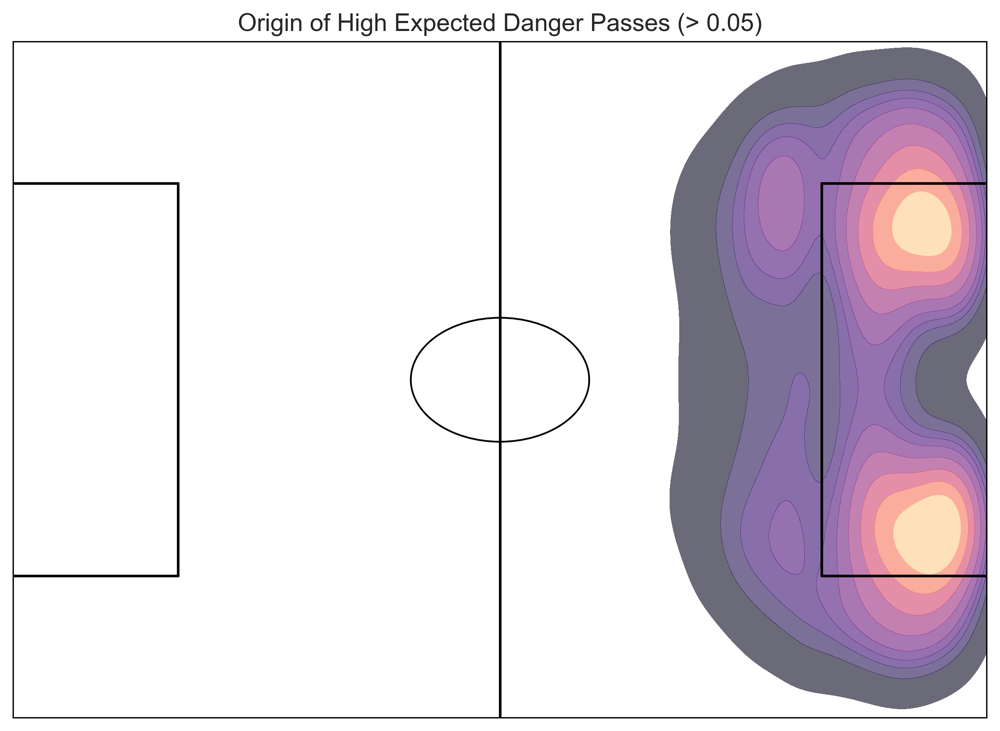
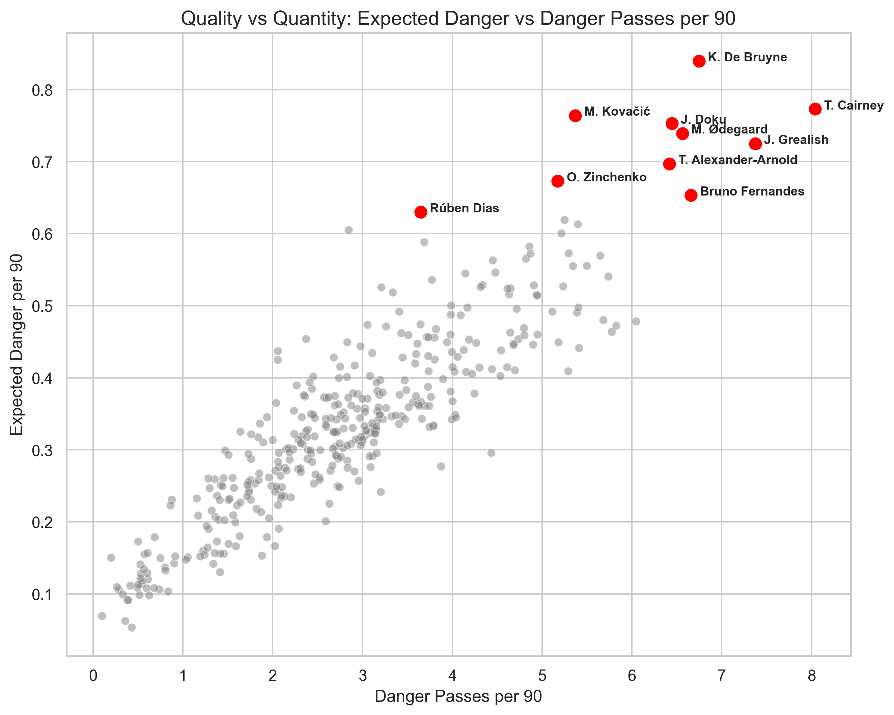
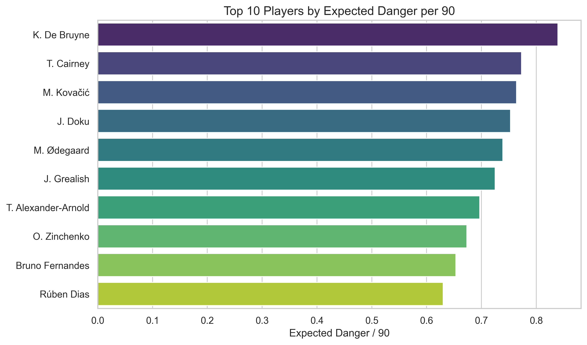

# Expected Danger Model: Premier League Analysis
 
## 1. Introduction
This report presents an "Expected Danger" (ED) model designed to quantify the threat of passes in the Premier League. Unlike simple assist counts, ED evaluates every pass based on:
1.  **Probability of leading to a shot within 15 seconds** (Logistic Regression).
2.  **Expected quality (xG) of that subsequent shot** (Linear Regression).

## 2. Methodology
*   **Data**: 320,903 passes from the Premier League season.
*   **Features**: Start and End coordinates (x, y), squared terms to capture non-linear pitch bias, and geometric features (distance/angle to goal).
*   **Metric**: $ED = P(\text{Shot}|\text{Pass}) \times E(\text{xG}|\text{Shot})$

## 3. Visualizations

### The Origin of Danger
The heatmap below reveals the zones on the pitch where "Dangerous Passes" (ED > 0.05) most frequently originate. As expected, the "half-spaces" and the zones immediately outside the penalty area are hotbeds for creativity.

### Quality vs. Quantity
Quantity (Danger Passes) is strongly correlated with Quality (Expected Danger), but outliers exist.
*   **Top Right**: The elite. High volume, high threat.
*   **Top Left**: High efficiency. Lower volume but lethal passes.
*   **Bottom Right**: High volume, lower average quality (often set-piece takers or volume crossers).

## 4. Player Rankings

### Top 10 Players by Expected Danger per 90
Kevin De Bruyne stands alone at the top, blending volume with exceptional pass quality.

### Insights & Comparison

| Player | ED per 90 | Danger Passes/90 | Insight |
| :--- | :--- | :--- | :--- |
| **K. De Bruyne** | **0.84** | 6.74 | **Quality King**. Fewer passes than Cairney, but highest threat. |
| **T. Cairney** | 0.77 | **8.04** | **Volume King**. Creates the most shots, but of slightly lower quality. |
| **J. Doku** | 0.75 | 6.45 | High threat from the wing. |
| **M. Ødegaard** | 0.74 | 6.56 | Balanced elite creator. |

**Correlation**: There is a strong positive correlation (**0.90**) between ED/90 and Danger Passes/90.

## 5. Positional Leaders

#### Defenders
Modern full-backs drive creativity from deep.
*   **T. Alexander-Arnold**: 0.70 ED/90
*   **O. Zinchenko**: 0.67 ED/90

#### Midfielders
The engine room of creativity.
*   **K. De Bruyne**: 0.84 ED/90
*   **T. Cairney**: 0.77 ED/90

#### Forwards
Direct threat and final balls.
*   **J. Doku**: 0.75 ED/90
*   **J. Grealish**: 0.73 ED/90

## 6. Conclusion
The Expected Danger model successfully identifies the league's most threatening passers. While volume of shot-creation is a strong proxy for danger, the ED metric highlights players like De Bruyne who maximize the *quality* of every opportunity they create.
